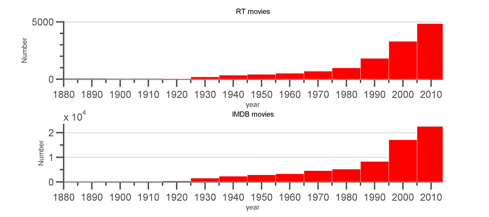
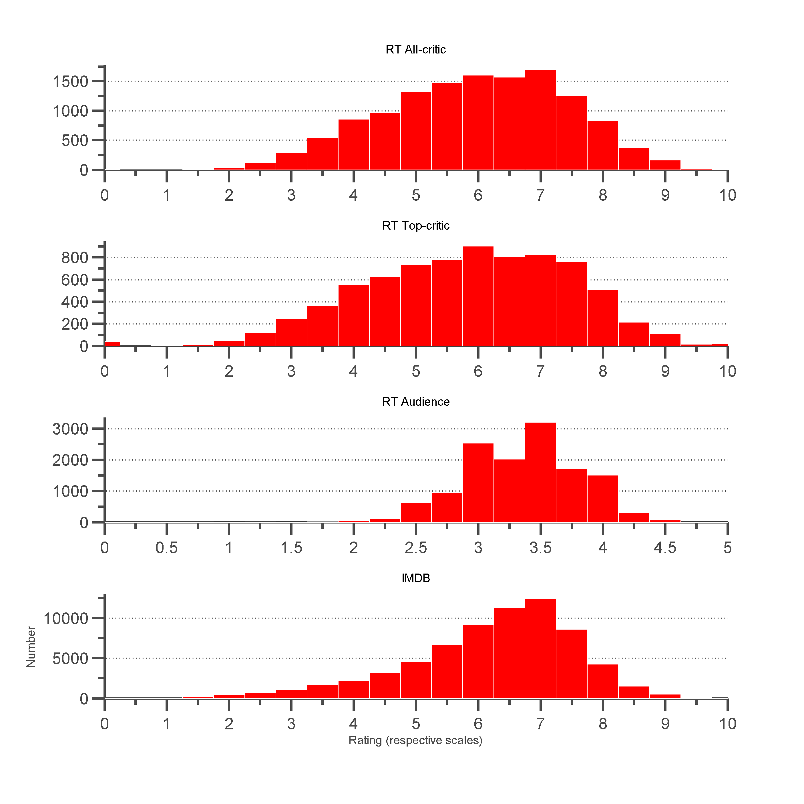
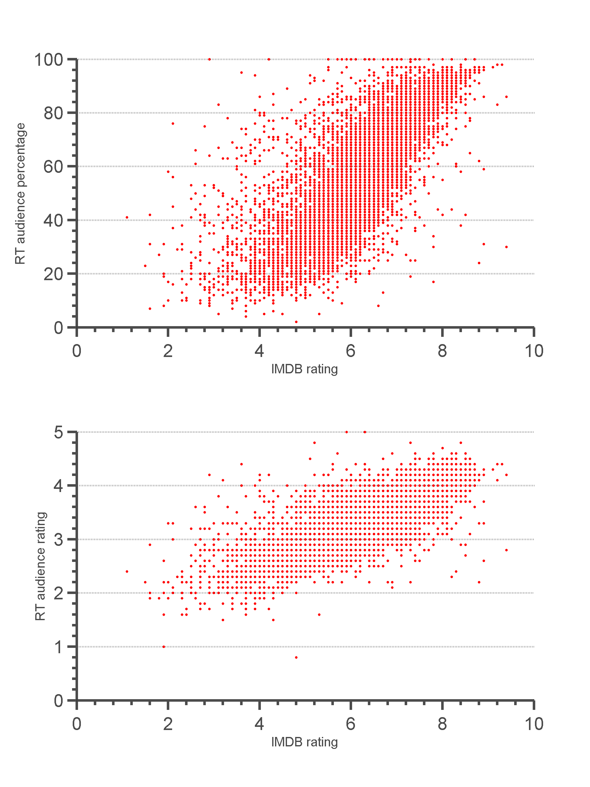
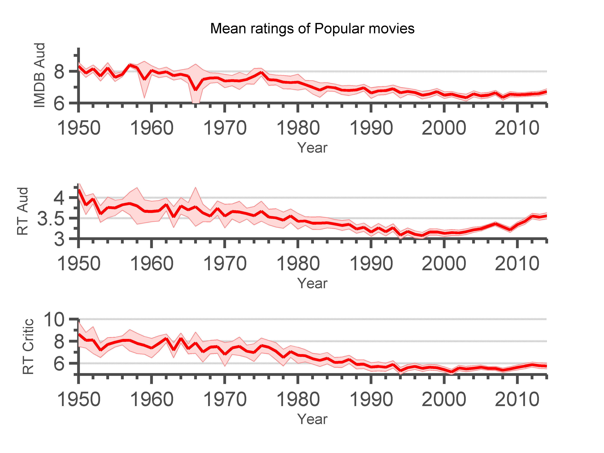
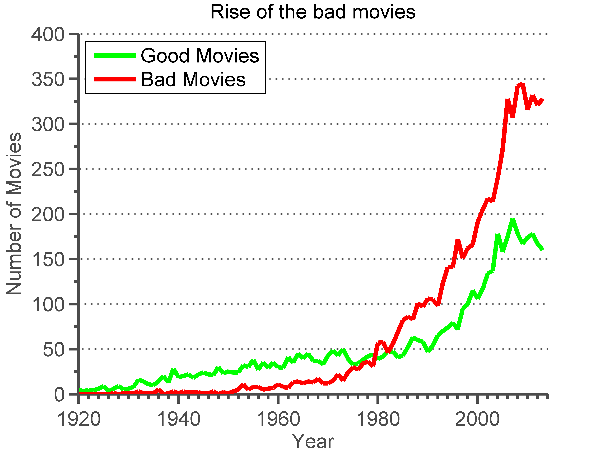
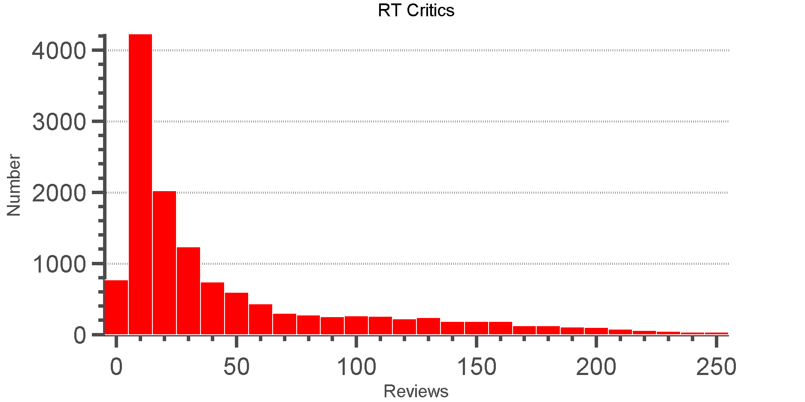
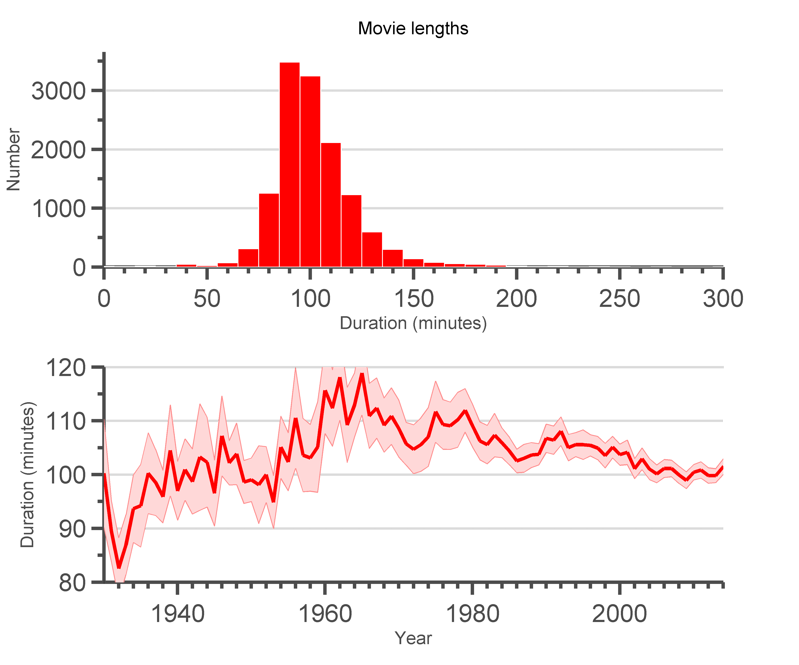
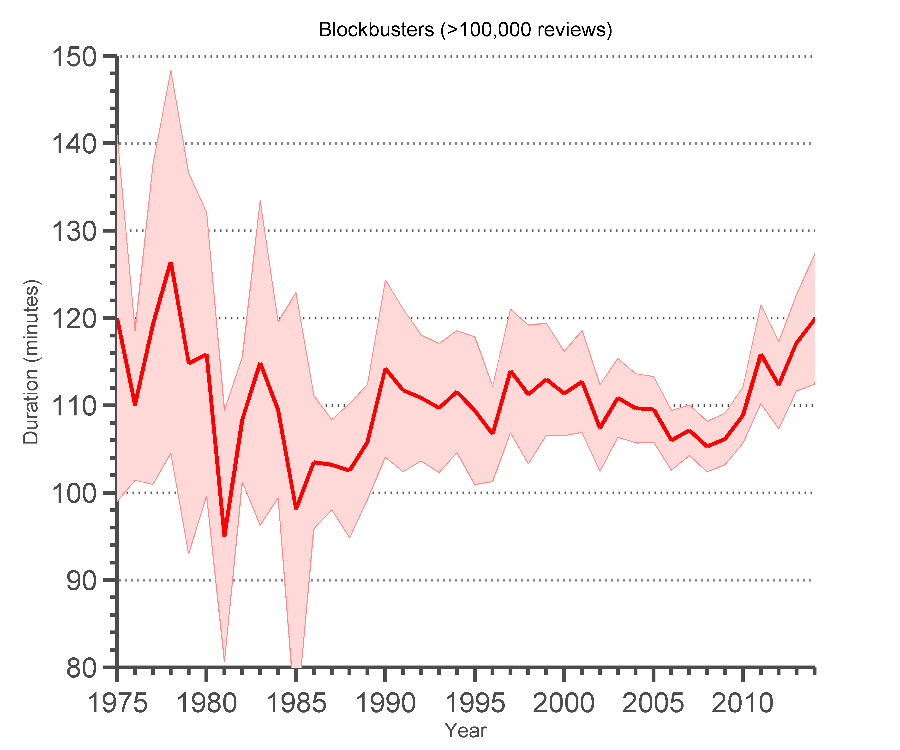



<meta http-equiv="refresh" content="0; url=http://goodmovies.ninja/analysis.html">
<link rel="canonical" href="http://goodmovies.ninja/analysis.html" />

<h4>More and more movies are released each decade.</h4>

<h4>Ratings are pretty well distributed, and most are better than the rating average (a rating of "5").</h4>

        
        

<h4>Ratings are well correlated between databases.</h4>

        
        
        

<h4>Mean ratings have slowly been changing over time, depending on the audience.</h4>

        

<h4>Mean ratings may have been changing because of the greater prevalence of "bad" movies (movies with low ratings).</h4>

        
        

<h4>Most movies on RT have 10-30 critic ratings, but there are a few movies with over 200.</h4>

     

<h4>The mean movie duration is about 95 minutes, though this has flucuated across the decades.</h4>

     

<h4>Interestingly, the duration of most popular movies have been increasing in recent years.</h4>

